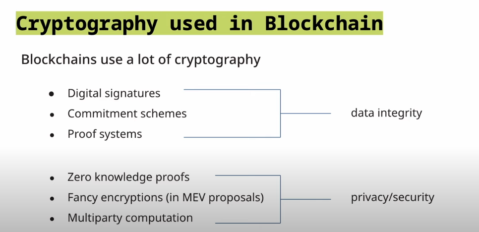

## 使用区块链中的加密算法来避免一些常见的问题

### 1. Dan Boneh

Dan Boneh 老师是斯坦福大学的教授，他现在在大学教的是应用加密算法和计算机安全领域的课程。 而且他现在是A16zCrypto的高级顾问，他从这次分享中讲了一些加密原语话的内容， 分享了如何在区块链领域如何正确使用加密算法。

### 2.区块链中的加密算法方向与分类 

在区块链中使用加密算法主要在两个方向 ，数据完整性(Data integrity)和隐私安全方面(privacy /security)。

在数据完整性方面通常包括

> 数字签名 digital signature
>
> 承诺方案   Commitment scheme
>
> 证明系统 proof system

在隐私安全方面包含:

> 零知识证明  Zero Knowledge proof
>
> 在MEV 提案中的奇特加密   Fancy Encryptions (MEV proposals)
>
> 多方计算 MultiParty Computation
>
> 

加密算法是区块链领域中必不可缺的一部分 ，如果自己写的程序它能够正常运行 ，但是如果不考虑安全的话， 这就是为之后的正常运行带来了一个安全隐患 。如果不正常使用它的话 ，会导致整个系统的不安全 ，所以正确理解使用密码学， 对整个应用的安全性是至关重要的。

### 3. 签名与数字签名

**物理签名**

在物理世界什么是签名呢 ？签名就是，通常用于这样一个场景 ，比如双方作出保证一些，或者一个双方共同达成的一个的协议 ，然后纸上签上名，代表我认同这个协议 ，我会按照这个协议的内容(规章制度) 来遵从。 物理签名就是找一只笔， 然后一个印章 ，再加上我自己的手印 ，我用笔来把我自己的真实的名字去签上 ，然后用大拇指沾上红印泥， 用大拇指按下去。

而这样的签名方式在数字世界有什么问题呢? 一个比较大的问题就是， 我的签名随时可以被别人复制、粘贴到各种不同的地方， 他们可以用我的签名去不断的作恶。

这个签名代表不了我

**数字世界的签名**

定义: 使用三种算法来完成签名

> * Gen()  (pk, sk)
> * Sign(sk, msg) -> Sig
> * Verify (pk, msg, sig) -> ‘accept’ / 'reject'

**existential unforgeability**

