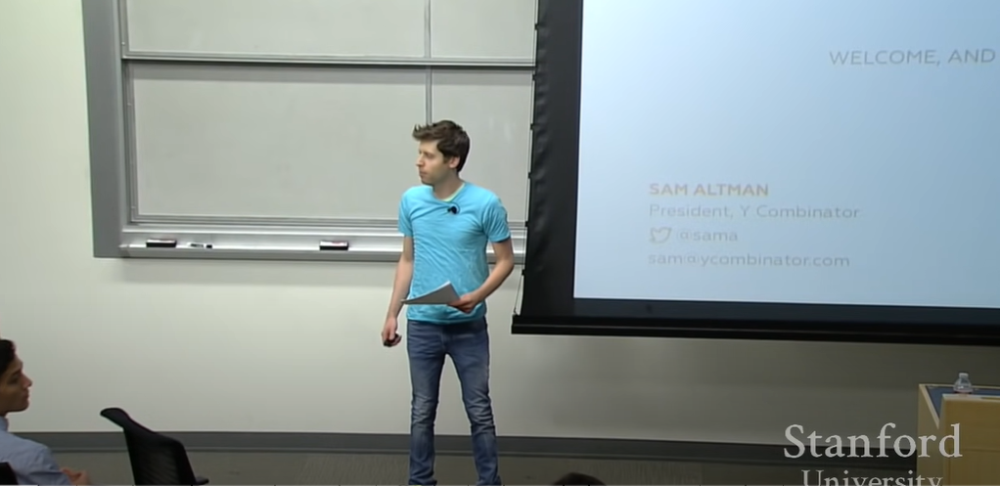

## A16Z Crypto Startup School Course Notes (CSS23 )

### 1. 为什么要写这篇笔记

A16Z(全称 [Andreessen Horowitz](https://en.wikipedia.org/wiki/Andreessen_Horowitz))是 [Marc Andreessen](https://en.wikipedia.org/wiki/Marc_Andreessen)和 [Ben Horowitz](https://en.wikipedia.org/wiki/Ben_Horowitz)两个人创造的一个风险投资机构 ，他们投了很多早期的创业和成长型企业 。他们的一些投资版图包括，健康、消费品牌、加密货币、游戏和最近在投的一些AI方面的初创企业。

[这个课程](https://a16zcrypto.com/crypto-startup-school/)是A16Z举办的一个12周的一个加速器计划， 然后每一周都会有一些人来讲一些Web3创业方向的一些知识。 这个课程包括了像是Crypto方面的Why How, What，然后一些协议设计，代币设计，用户交互UX设计，Web3的商业模式，基建Infua，安全Security ，零知识证明ZK，还有就是包括像公司的企业文化 ，Marketing和一些社区建设的部分。

受益于[2014年的 YC 创业课 - How to Start A Startup CS183B ](https://www.youtube.com/playlist?list=PL5q_lef6zVkaTY_cT1k7qFNF2TidHCe-1)( 课程的开讲人就是Sam，当时Sam Altman 还很青涩 哈哈）。现在学习这个课程，就是靠着他的OpenAI企业所衍生的一系列工具来增强自己学习的一个效果。

而且呢，当时是受[李笑来老师的推荐](https://mp.weixin.qq.com/s?__biz=Mzg2NTgxNDY0Nw==&mid=2247488830&idx=2&sn=129a78899a0daf72f7eb8e55c3f56c92&source=41#wechat_redirect)去看了这门Start Up课程 ，这门课程讲得非常非常好。然后演讲的嘉宾也是像[Paul Graham YC创业营 ](http://www.paulgraham.com/), Marc Andreessen(上面A16ZFounder) 这些大牛。他们创造了一些伟大的企业，在YC创业课程方面讲述了很多关于创业方面的知识，比如企业成长， 融资，企业文化，团队建设，市场营销等等。对当时的我很有启发(现在也受益很多)。 

课程最后的那段[Sam对19岁年轻人的建议](https://blog.samaltman.com/advice-for-ambitious-19-year-olds)，也是听得我热血沸腾。

> * No matter what you choose, build stuff and be around smart people. 
>
> * Getting nothing done for four of your most productive years is actually pretty risky
> *  If you fail at an idea that you really loved and could have been great, you’re unlikely to regret it, and people will not hold it against you
> * One big pro for starting a company is that it’s usually the way to learn the most in the shortest amount of time. 

这也是我最喜欢Crypto行业的一个原因，从最早的开源，Geek 精神，慢慢的进化出智能合约，之后各种玩法玩法(defi，NFT，Staking，TradFi, Farming, Arbitrage)，有很多创新，走向了百花齐放的时代。

> * 这里聪明人多，即使是有很多Ponzi ,骗子项目，也是证明他足够聪明才能骗到自己。 而且最近的各个生态的hackathon ，都有很多聪明人在Build 有趣的项目。
> * 最富有动力，生产力的几年，应该把时间花在能够获得成长最多的领域，在学习工作上追求一个只是"看起来"很稳定的一些东西，我觉得对自己是不负责任的。
> * 在自己的想法上，自己想要去尝试的做的事情上，如果当下我不做这些事情，在很多年后我会因为没做这件事情而感到非常的后悔。我对自己的后悔，会远远大于对当下做错失败而面临一系列问题的恐惧。
>
> * 学习是很重要的一件事情。能够在最短时间内学到最多的东西是值得的。从最简单的"Making some Stuff"，一步步学习"Startup"，我们会面临很多问题，但是，不要恐惧，在这个过程中，自己解决问题的能力也在不断的提高。

### 2. 课程计划

 

在自己的观念中，Startup 永远是那些勇敢者的游戏，冒险家的乐园。

当看到那些校园里面的"小屁孩"，在没有很多资源的情况下，依然敢于大胆的创造(create)，从一个小小的点子，慢慢积累到MVP，营销，迭代的时候，我开始感觉自己有点"灰头土脸", 有点"无地自容"。

**如果处在大学的我知道这些，敢于做这些该有多好？ 再敢想一下，如果我在中学知道这些该有多好？**

[Charlie Munger]([Charlie Munger - Wikipedia](https://en.wikipedia.org/wiki/Charlie_Munger)) (巴菲特的合伙人)曾经说过这样一段话

>  Principle of inversion - All I want to know is where I'm going to die  
>
> 逆向思维原则 - *如果我知道我会死在哪里，那么我永远也不会去那个地方。*

如果要做一件事情， 使用逆向思维来进行思考，如果我不做这件事情，会怎样？

可能在未来N年后的酒桌上，可能会感到后悔感慨当。在每天加班, 每天996的情况下会后悔, 我在被裁员之后四处找不到工作会后悔 

所有这些都是指向对这环境的抱怨，而不是对自己所处环境的一个挣扎 。抱怨其实在很大程度上是没有任何意义的 ， 而只能从情绪上博得别人的认同 ，只有有勇气的人去面对当下我们所处的一个真实的环境 ，去挣扎着尽可能让自己更加完善。

这条路，也是一段修行，到最后才发现，我们真正能做到的，之后认识自己。

我们处于一个爆发的时代

